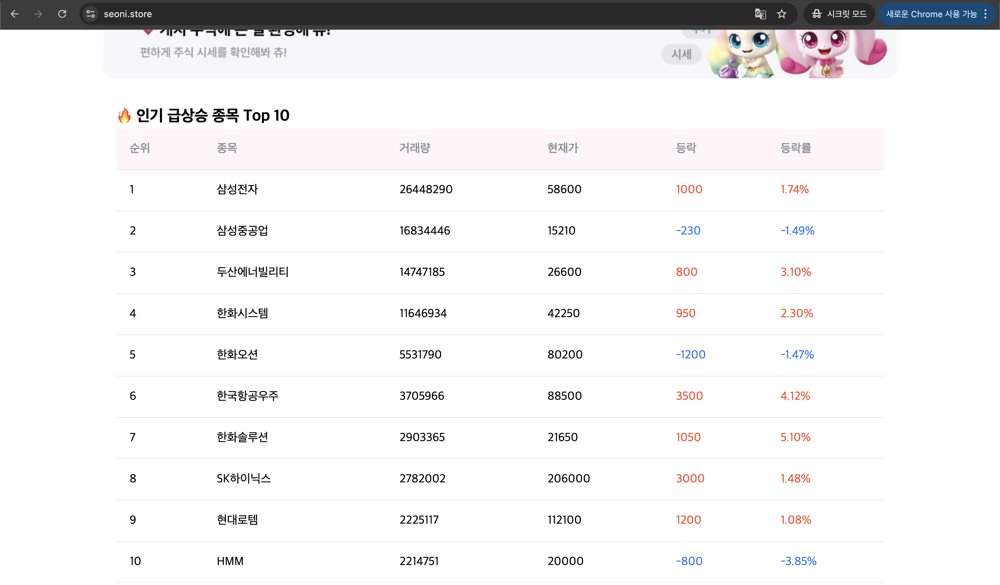
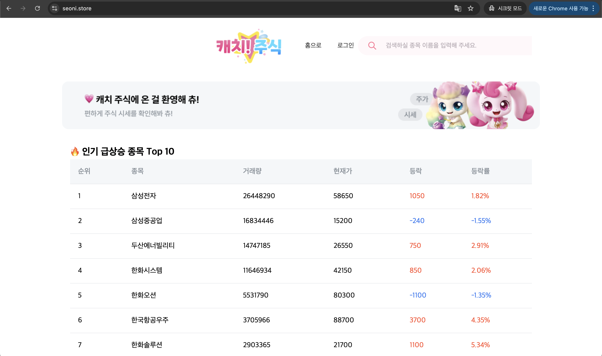
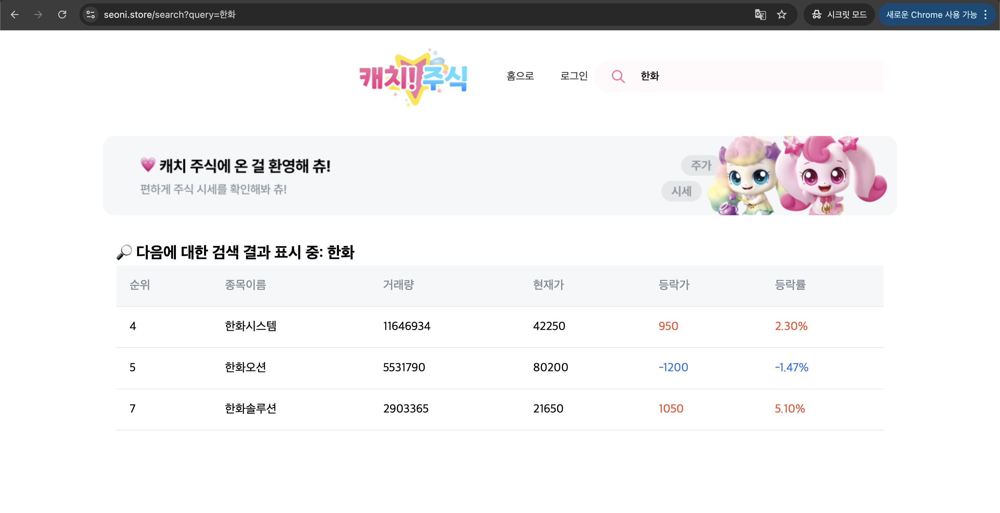
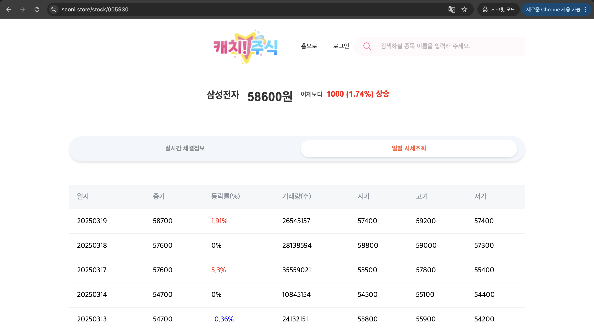
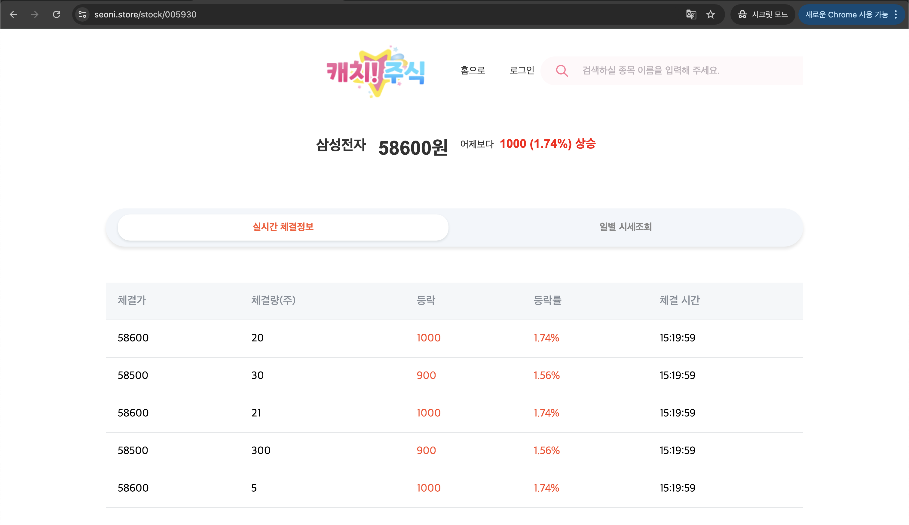

## 💨 서비스 소개

---

개발 기간 : 2024.12.06 - 2025.03.24

실시간 주식 시세 조회 서비스

## 💨 목표

---

### 자동화를 통한 운영 효율성 향상

🏷️ GitHub Actions, ArgoCD, Kustomize를 통한 GitOps 기반의 CICD 파이프라인 구축

🏷️ Terraform을 통한 인프라 구성 자동화

🏷️ Ansible을 통한 서버 설정 자동화

### 고가용성 및 재해 복구를 고려한 재해 대응 전략 개발

🏷️ AWS RDS Multi-AZ를 통해 RDS 고가용성 확보

🏷️ Redis Sentinel을 통해 Redis 고가용성 확보

🏷️ AWS 자동 백업을 통해 재해 복구

### 사용자에게 신속하고 안전한 서비스 제공

🏷️ Kafka를 통해 데이터 무결성 처리

🏷️ AWS ACM 인증서를 통한 통신 암호화

🏷️ AWS Secret Manager로 Credential 관리

## 💨 아키텍처

---

## 💨 기능

---

### 메인페이지

### 검색페이지

### 상세페이지

